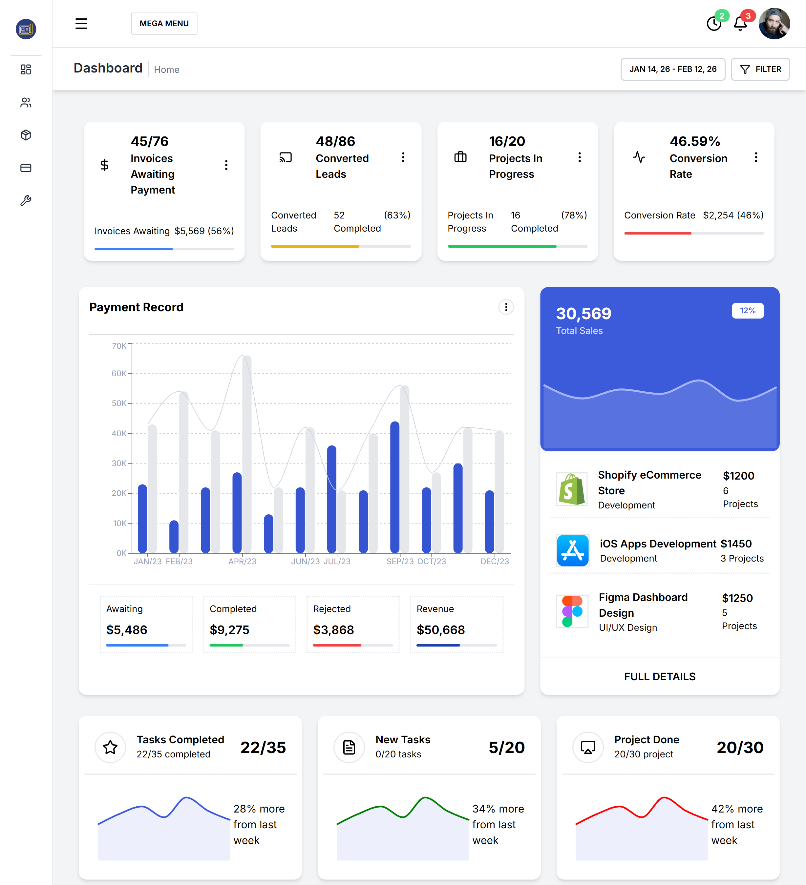
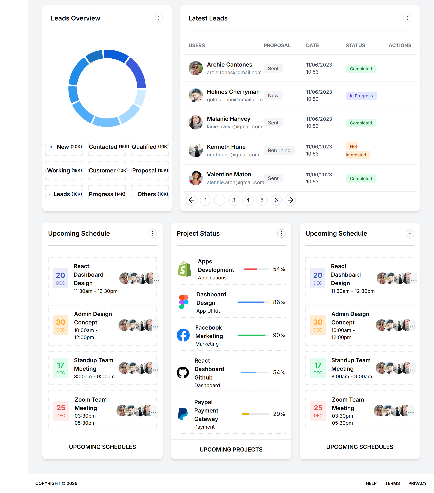

## Dashboard 

A modern and responsive **dashboard interface** built using **React** and **Tailwind CSS**, following common patterns used in real world dashboard applications.

The project focuses on clean UI structure, component reusability, and scalable layout design.

---

## 🎯 Why This Project
Dashboards are a core part of many applications.  
This project was created to:
- Understand how dashboards are architected
- Practice React component based development
- Learn how to structure layouts efficiently
- Improve styling using utility first CSS

---

## 🧠 What I Learned
- Building reusable UI components in React
- Managing layout and component hierarchy
- Creating responsive dashboard layouts
- Using Tailwind CSS for rapid UI development
- Customizing Tailwind with theme colors and fonts
- Writing clean and readable frontend code

---

## 📸 Preview

⭐ Feel free to explore the repository and code structure.
